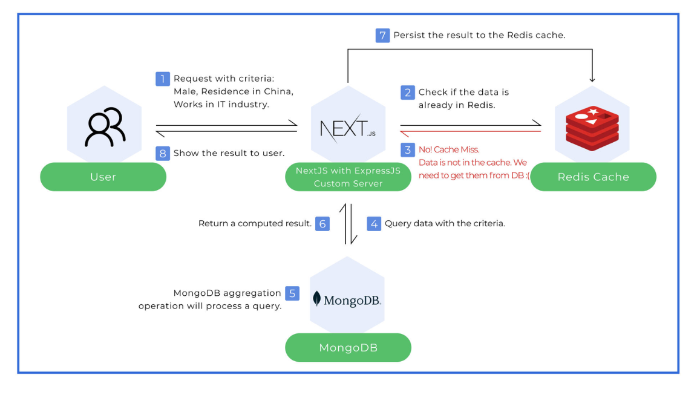

NOTE: to run this project install redis locally in your system.
Proper redis server will be added soon.

Here's a **Redis Cheatsheet** with commonly used commands, grouped by category for easy reference:

---

### **Basic Commands**
| Command                       | Description                                    |
|-------------------------------|------------------------------------------------|
| `SET key value`               | Set the value of a key.                        |
| `GET key`                     | Get the value of a key.                        |
| `DEL key`                     | Delete a key.                                  |
| `EXISTS key`                  | Check if a key exists (returns 1 or 0).        |
| `EXPIRE key seconds`          | Set a key's time-to-live in seconds.           |
| `TTL key`                     | Get the remaining time-to-live of a key.       |
| `PERSIST key`                 | Remove the expiration from a key.              |

---

### **String Operations**
| Command                       | Description                                    |
|-------------------------------|------------------------------------------------|
| `INCR key`                    | Increment a key's value by 1.                  |
| `INCRBY key increment`        | Increment a key's value by the specified amount.|
| `DECR key`                    | Decrement a key's value by 1.                  |
| `DECRBY key decrement`        | Decrement a key's value by the specified amount.|
| `APPEND key value`            | Append a value to a key's current value.       |
| `STRLEN key`                  | Get the length of the value stored at key.     |

---

### **Hash Commands**
| Command                       | Description                                    |
|-------------------------------|------------------------------------------------|
| `HSET hash field value`       | Set a field in a hash.                         |
| `HGET hash field`             | Get a field's value in a hash.                 |
| `HDEL hash field`             | Delete a field from a hash.                    |
| `HEXISTS hash field`          | Check if a field exists in a hash.             |
| `HGETALL hash`                | Get all fields and values in a hash.           |
| `HKEYS hash`                  | Get all field names in a hash.                 |
| `HVALS hash`                  | Get all values in a hash.                      |
| `HLEN hash`                   | Get the number of fields in a hash.            |

---

### **List Commands**
| Command                       | Description                                    |
|-------------------------------|------------------------------------------------|
| `LPUSH list value`            | Push a value to the beginning of a list.       |
| `RPUSH list value`            | Push a value to the end of a list.             |
| `LPOP list`                   | Remove and get the first element of a list.    |
| `RPOP list`                   | Remove and get the last element of a list.     |
| `LRANGE list start stop`      | Get elements from a list (start and stop are indices). |
| `LLEN list`                   | Get the length of a list.                      |

---

### **Set Commands**
| Command                       | Description                                    |
|-------------------------------|------------------------------------------------|
| `SADD set value`              | Add a value to a set.                          |
| `SREM set value`              | Remove a value from a set.                     |
| `SISMEMBER set value`         | Check if a value exists in a set.              |
| `SMEMBERS set`                | Get all members of a set.                      |
| `SCARD set`                   | Get the number of members in a set.            |
| `SDIFF set1 set2`             | Get members in `set1` but not in `set2`.       |
| `SINTER set1 set2`            | Get members common to both sets.               |
| `SUNION set1 set2`            | Get members in either set.                     |

---

### **Sorted Set Commands**
| Command                       | Description                                    |
|-------------------------------|------------------------------------------------|
| `ZADD zset score value`       | Add a value to a sorted set with a score.      |
| `ZRANGE zset start stop`      | Get elements in a range (by index).            |
| `ZREVRANGE zset start stop`   | Get elements in reverse order (by index).      |
| `ZRANGEBYSCORE zset min max`  | Get elements within a score range.             |
| `ZREM zset value`             | Remove a value from a sorted set.              |
| `ZCARD zset`                  | Get the number of elements in a sorted set.    |

---

### **Pub/Sub Commands**
| Command                       | Description                                    |
|-------------------------------|------------------------------------------------|
| `PUBLISH channel message`     | Publish a message to a channel.                |
| `SUBSCRIBE channel`           | Subscribe to a channel.                        |
| `UNSUBSCRIBE channel`         | Unsubscribe from a channel.                    |

---

### **Key Management**
| Command                       | Description                                    |
|-------------------------------|------------------------------------------------|
| `KEYS pattern`                | Get all keys matching a pattern.               |
| `SCAN cursor MATCH pattern COUNT count` | Incrementally iterate keys matching a pattern. |
| `RENAME oldKey newKey`        | Rename a key.                                  |
| `TYPE key`                    | Get the data type of a key.                    |
| `FLUSHALL`                    | Delete all keys in all databases.              |
| `FLUSHDB`                     | Delete all keys in the current database.       |

---

### **Transactions**
| Command                       | Description                                    |
|-------------------------------|------------------------------------------------|
| `MULTI`                       | Start a transaction.                           |
| `EXEC`                        | Execute all commands in a transaction.         |
| `DISCARD`                     | Cancel a transaction.                          |
| `WATCH key`                   | Watch a key for changes before a transaction.  |
| `UNWATCH`                     | Unwatch all keys.                              |

---

### **Server Management**
| Command                       | Description                                    |
|-------------------------------|------------------------------------------------|
| `PING`                        | Check the connection to the Redis server.      |
| `INFO`                        | Get server information.                        |
| `CONFIG GET parameter`        | Get Redis server configuration parameters.     |
| `CONFIG SET parameter value`  | Set a Redis server configuration parameter.    |
| `BGSAVE`                      | Save the dataset to disk in the background.    |
| `SHUTDOWN`                    | Stop the Redis server.                         |

---

### **Script Commands**
| Command                       | Description                                    |
|-------------------------------|------------------------------------------------|
| `EVAL script numkeys key1 key2 ... args` | Execute a Lua script.               |
| `SCRIPT LOAD script`          | Load a Lua script into the script cache.       |
| `SCRIPT EXISTS sha1`          | Check if a Lua script exists in the cache.     |
| `SCRIPT FLUSH`                | Remove all Lua scripts from the cache.         |

---

### **Useful Tips**
1. **Persistence Configuration:**  
   Enable snapshotting (RDB) or append-only file (AOF) for data persistence.
   - Use `CONFIG SET save "60 1000"` for snapshots (every 60 seconds if 1000 keys are changed).

2. **Redis as Cache:**  
   - Set expiration for keys with `EXPIRE key seconds`.
   - Use `LRU` (Least Recently Used) eviction policies for memory optimization.

3. **Connection Management:**  
   Use `AUTH password` to secure Redis with authentication.

---

Let me know if you want explanations or examples for any specific commands! 🚀